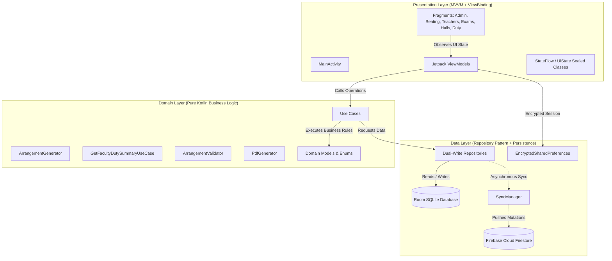
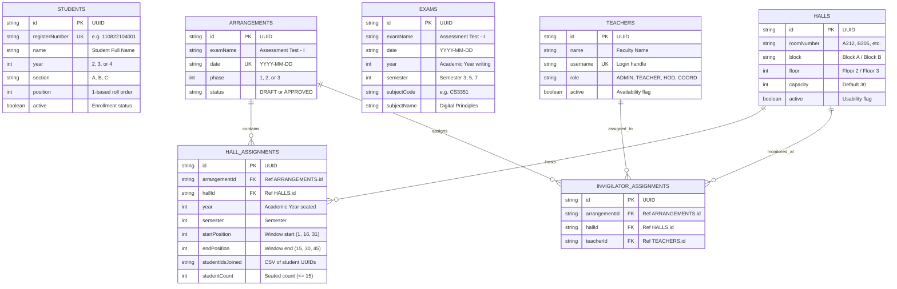
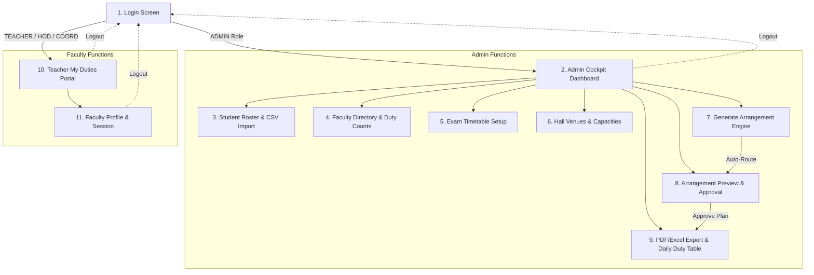

# 🏛️ GRT Exam Seating Arrangement & Faculty Duty Allocation System

[-3DDC84.svg?style=flat&logo=android)](https://developer.android.com)
[](https://kotlinlang.org)
[-02303A.svg?style=flat&logo=gradle)](https://gradle.org)
[](https://developer.android.com/topic/architecture)
[](https://dagger.dev/hilt/)
[](https://developer.android.com/training/data-storage/room)
[](https://itextpdf.com/)
[](https://firebase.google.com)
[](#)

---

## 📋 Table of Contents
1. [Executive Overview](#-executive-overview)
2. [Key Capabilities & Innovations](#-key-capabilities--innovations)
3. [System Architecture & Design Patterns](#-system-architecture--design-patterns)
4. [Database Schema & Entity Relationships](#-database-schema--entity-relationships)
5. [Algorithmic Allocation & Mathematical Constraints](#-algorithmic-allocation--mathematical-constraints)
6. [Application Navigation & Screen Catalog](#-application-navigation--screen-catalog)
7. [Technology Stack & Dependency Matrix](#-technology-stack--dependency-matrix)
8. [Core Domain APIs & Data Contracts](#-core-domain-apis--data-contracts)
9. [Build, Test & Deployment Guide](#-build-test--deployment-guide)
10. [Future Roadmap & Institutional Announcements](#-future-roadmap--institutional-announcements)

---

## 🌟 Executive Overview

The **GRT Exam Seating Arrangement** system is a production-grade, offline-first mobile application architected specifically for academic institutions and college central examination cells (tailored for **GRT Institute of Engineering and Technology**).

Administering university and collegiate internal examinations (e.g., *Assessment Test - I*, *Semester Final Examinations*) involves severe logistical friction:
- Grouping hundreds of students across multiple academic cohorts (2nd, 3rd, and 4th Years) into physical venues.
- Enforcing strict regulatory anti-malpractice rules requiring **two distinct academic years per hall** ($15 + 15 = 30$ students per hall).
- Preserving bench assignments and roll number continuity without shifting students when absentees or debarred positions occur.
- Distributing faculty invigilation duties equitably across all available teaching staff while accounting for regulatory exemptions (HODs exempt, Exam Cell Coordinator restricted to $\le 1$ duty).
- Providing complete visibility into **both daily hall assignments and total duties per teacher across the entire examination period**.

This application solves these institutional challenges with mathematical rigor, providing real-time room generation, live duty tracking, multi-channel exports (iText 9 high-resolution A4 landscape PDF documents and CSV/Excel spreadsheets), and dual-write cloud synchronization.

```
┌──────────────────────────────────────────────────────────────────────────────────────────────────┐
│                                   COLLEGE EXAMINATION CELL                                       │
│                                                                                                  │
│   [Student Cohorts]      [Exam Timetable]      [Hall Venues]      [Teaching Faculty]             │
│    353 Active Dept        6-Day Exam Period      12 Physical Halls   15 Academic Staff           │
│    2nd, 3rd, 4th Year     FN Sessions            Max 30 / Hall       Professors / APs            │
└───────────┬──────────────────────┬───────────────────┬─────────────────────┬─────────────────────┘
            │                      │                   │                     │
            ▼                      ▼                   ▼                     ▼
┌──────────────────────────────────────────────────────────────────────────────────────────────────┐
│                   GRT ALLOCATION ENGINE (Domain Layer / Pure Kotlin Logic)                       │
│                                                                                                  │
│   • 15-Position Batching Window         • Fair Workload Balancing: Max(D) - Min(D) <= 1          │
│   • Gap Preservation (Missing Pos)      • Consecutive Invigilation Prevention                    │
│   • Two Academic Years per Hall         • HOD Excluded / Coordinator <= 1 Duty                   │
└──────────────────────────────────────────────────┬───────────────────────────────────────────────┘
                                                   │
                                                   ▼
┌──────────────────────────────────────────────────────────────────────────────────────────────────┐
│                         INSTITUTIONAL OUTPUTS & OPERATIONAL INTERFACES                           │
│                                                                                                  │
│   📱 Admin Control Cockpit               📄 iText 9 Print-Ready A4 Hall Charts                   │
│   👨‍🏫 Faculty "My Duties" Portal         📊 CSV / Excel Multi-Sheet Export                       │
│   📊 Real-Time Exam Duty Counts          ☁️ Dual-Write Cloud Sync (Room + Firebase Firestore)    │
└──────────────────────────────────────────────────────────────────────────────────────────────────┘
```

---

## 🚀 Key Capabilities & Innovations

### 1. Dual Academic Year Interleaved Seating
- In compliance with Anna University and autonomous college regulations, examination halls contain 30 desks arranged in 2 columns of 15 benches.
- The engine enforces that each hall contains exactly **two distinct academic years** (e.g., 15 students from 2nd Year + 15 students from 4th Year).
- Single-cohort cheating is prevented by ensuring adjacent desks seat students writing different examination question papers.

### 2. Deterministic 15-Position Batching with Gap Preservation
- Students are organized into immutable 15-position windows: `1–15`, `16–30`, `31–45`, `46–60`, etc.
- **Discontinuity Resilience**: If a student at position 44 is discontinued, absent, or debarred, the batch spanning `31–45` contains 14 students. Students at position 46+ are **never** shifted backward to fill the slot. This guarantees desk and hall stability across all examination dates.

### 3. Comprehensive Faculty Duty Tracking (Per Day & Per Exam)
- **Daily Duty Roster**: Live table in the Seating Arrangement screen showing all 12 invigilators assigned on any selected date, mapped to S.No, Invigilator Name, Role, Hall Number (`A212`, `B205`), Floor, Block, and Session (`8:40 a.m. TO 10:10 a.m. (FN)`).
- **Total Duties Per Exam Series**: In both Teacher Management and Seating screens, administrators can monitor the **total number of duties each teacher is getting for the whole examination** (e.g., `4 Duties (Assessment Test - I)`).
- **Interactive Breakdown Dialogs**: Tapping any teacher card reveals every assigned date, room number, floor, block, and exam timing. An "All Duty Counts" modal provides a ranked workload overview.

### 4. Workload Balancing & Invigilator Equity
- The invigilation allocation algorithm enforces:
  $$\max_{t \in \text{Teachers}}(\text{Duties}_t) - \min_{t \in \text{Teachers}}(\text{Duties}_t) \le 1$$
- **HOD Exemption**: Head of Department (`UserRole.HOD`) is strictly excluded from invigilation duties.
- **Coordinator Capping**: Exam Cell Coordinator (`UserRole.EXAM_CELL_COORDINATOR`) is assigned at most 1 single duty during the examination series.
- **Fatigue Reduction**: Teachers who invigilated on day $N-1$ are deprioritized on day $N$.

### 5. Dual-Mode Operation (100% Offline-First + Cloud Dual-Write)
- **Offline Demo Mode**: Runs standalone with zero internet or cloud credentials. Local Room SQLite database pre-populates with 353 students, 15 faculty members, 12 halls, and 17 examination subjects.
- **Firebase Cloud Mode**: Drop `google-services.json` into `app/` to unlock dual-write synchronization to Firebase Firestore and authentication via Firebase Auth across administrative devices.

---

## 🏗️ System Architecture & Design Patterns

The project strictly follows **Clean Architecture** combined with the **MVVM (Model-View-ViewModel)** presentation pattern and **Unidirectional Data Flow (UDF)**.



### Architectural Layering Principles:
1. **Presentation Layer (`com.example.examhallallocation.presentation`)**:
   - Built with **Android Jetpack ViewBinding** and Material Design 3.
   - ViewModels expose immutable `StateFlow<T>` streams consumed via lifecycle-aware coroutines (`viewLifecycleOwner.repeatOnLifecycle`).
   - Zero business or allocation logic resides within Activity/Fragment controllers.
2. **Domain Layer (`com.example.examhallallocation.domain`)**:
   - Written in **100% pure Kotlin** without Android framework dependencies.
   - Encapsulates pure business entities, mathematical rules, sorting algorithms, and use cases.
   - Fully testable in millisecond-fast local JVM unit tests without emulators.
3. **Data Layer (`com.example.examhallallocation.data`)**:
   - **Room Database** acts as the single source of truth (`SSOT`).
   - Repositories mediate between local SQLite tables and remote Firestore documents.
   - Dual-write pattern: Write to Room first; immediately follow with non-blocking Firestore dispatch.

---

## 🗄️ Database Schema & Entity Relationships

The local persistence layer is powered by **Android Room Database 2.8.5** ([ExamHallDatabase.kt](file:///c:/Users/Public/ExamHallAllocation/app/src/main/java/com/example/examhallallocation/data/local/ExamHallDatabase.kt)), structured across 7 normalized relational tables:



---

## 🧮 Algorithmic Allocation & Mathematical Constraints

The algorithmic core resides in [ArrangementGenerator.kt](file:///c:/Users/Public/ExamHallAllocation/app/src/main/java/com/example/examhallallocation/domain/usecase/ArrangementGenerator.kt), executing a multi-stage allocation process:

### 1. Phase Determination
The engine analyzes the exam timetable for date $D$ to identify scheduled academic cohorts:
$$\text{ScheduledYears}(D) = \{ e.\text{year} \mid e \in \text{Exams}, e.\text{date} = D \}$$

| Phase | Conditions | Venues Allowed | Capacity & Seating Structure |
|---|---|---|---|
| **Phase 1** | Years 2, 3, and 4 are writing | Up to 12 Halls | Interleaved 15+15 mixed years per hall ($C \le 30$). Single student per desk. |
| **Phase 2** | Years 2 and 3 are writing | Up to 8 Halls | Interleaved 15+15 mixed years per hall ($C \le 30$). Single student per desk. |
| **Phase 3** | Year 3 only is writing | Exactly 2 Halls | Dual students per bench (double capacity allowed, up to 60 per hall). |

### 2. Deterministic Window Batching
For each year $Y$, active students are partitioned by position:
$$\text{Window}_k = \left[ 15(k-1) + 1, \; 15k \right], \quad k \in \{1, 2, \dots\}$$
Students whose `position` falls inside $\text{Window}_k$ are placed into batch $k$. If any positions are vacant within that window, the batch capacity reflects only the present count ($n \le 15$); neighboring batches are **never** mutated.

### 3. Multi-Tiered Faculty Assignment
Invigilators are selected for date $D$ by filtering eligible faculty:
$$\text{EligibleTeachers} = \{ t \in \text{Teachers} \mid t.\text{active} = \text{true}, \; t.\text{role} \notin \{\text{ADMIN}, \text{HOD}\} \}$$
If $t.\text{role} = \text{EXAM\_CELL\_COORDINATOR}$, $t$ is included only if $\text{Duties}(t) = 0$.

Candidate teachers are ranked by:
1. **Total Cumulative Duties** (ascending order — lowest duties first).
2. **Consecutive Run Penalty** (teachers who invigilated on $D-1$ are ordered last).
3. **Controlled Deterministic Shuffle** (breaks remaining ties fairly).

### 4. Integrity Verification & Audit Gate
Before persisting an allocation, [ArrangementValidator.kt](file:///c:/Users/Public/ExamHallAllocation/app/src/main/java/com/example/examhallallocation/domain/usecase/ArrangementValidator.kt) evaluates 6 invariant rules:
1. $\forall h \in \text{HallsUsed}, \; \text{TotalSeated}(h) \le h.\text{capacity}$.
2. Every student ID appears at most once on date $D$.
3. Every occupied hall is paired with exactly one distinct invigilator.
4. No teacher is assigned to multiple halls on date $D$.
5. Batch boundary condition: $\text{startPosition} \pmod{15} == 1$.
6. Phase 3 strict constraint: $\text{count}(\text{HallsUsed}) = 2$.

---

## 📱 Application Navigation & Screen Catalog

The user interface implements a single-activity container architecture driven by `nav_graph.xml`:



### Detailed Screen Summary:
| # | Screen / Fragment | Layout File | Description & Key Functions |
|---|---|---|---|
| **1** | **Login** | `fragment_login.xml` | Credential entry, encrypted session caching, and Demo Quick-Login buttons. |
| **2** | **Admin Dashboard** | `fragment_admin_dashboard.xml` | Real-time metric cards (Students, Teachers, Halls, Approval Status) and quick actions. |
| **3** | **Student Roster** | `fragment_students.xml` | Year filtering chips (2nd, 3rd, 4th), search bar, manual add/edit, and CSV bulk import. |
| **4** | **Faculty Directory** | `fragment_teachers.xml` | Workload banner, total duty badges per exam, teacher breakdown dialogs, and All Duty Counts modal. |
| **5** | **Exam Setup** | `fragment_exams.xml` | Chronological exam schedule, date picker dialog, subject codes, and academic year mappings. |
| **6** | **Hall Venues** | `fragment_halls.xml` | Room registry (`A212`, `B205`), block identifier, floor level, capacity settings, and active toggles. |
| **7** | **Generate Engine** | `fragment_generate.xml` | Live allocation trigger, active rules reminder, calculation progress, and summary statistics. |
| **8** | **Arrangement Preview** | `fragment_preview.xml` | Hall allocation review cards, roll number windows, invigilator badges, regeneration, and approval. |
| **9** | **Seating & Duty Table** | `fragment_pdf_export.xml` | Full daily duty roster table, "Duties in Exam" column, Exam Duties Summary dialog, and iText 9 PDF export. |
| **10**| **Teacher "My Duties"** | `fragment_teacher_dashboard.xml` | Personalized duty alerts, assigned hall, floor, block, exam timings, and seated student roll list. |
| **11**| **Teacher Profile** | `fragment_teacher_profile.xml` | User account details, designation, assigned department, and secure sign-out. |

---

## 🛠️ Technology Stack & Dependency Matrix

| Category | Component / Library | Version | Technical Rationale & Role |
|---|---|---|---|
| **Language** | Kotlin | `2.3.12` | Modern concise syntax, Coroutines, Flow, sealed hierarchies, and type safety. |
| **Compiler Plugin** | KSP (Kotlin Symbol Processing) | `2.3.12` | High-speed annotation processing for Room and Dagger Hilt. |
| **Build System** | Android Gradle Plugin (AGP) | `9.4.0` | Gradle 8.x integration, Kotlin DSL (`build.gradle.kts`), and R8 optimization. |
| **Java Compatibility** | Java 11 + Desugaring | `2.1.5` | `coreLibraryDesugaring` backports modern Java time/stream APIs to Android 7.0+. |
| **Architecture** | AndroidX Jetpack Lifecycle & ViewModel | `2.9.0` | Lifecycle-aware reactive view models and state management. |
| **Navigation** | Jetpack Navigation Component | `2.9.6` | Single-Activity container, type-safe arguments, and navigation graph routing. |
| **Dependency Injection** | Dagger Hilt | `2.60.1` | Compile-time inversion of control and automated dependency graphs. |
| **Local Database** | AndroidX Room Database | `2.8.5` | Type-safe SQLite object relational mapping with coroutine Flow integration. |
| **Security & Crypto** | AndroidX Security Crypto | `1.1.0` | Hardware-backed `EncryptedSharedPreferences` utilizing AES-256 GCM. |
| **Document Engine** | iText 9 Core | `9.2.0` | Enterprise A4 Landscape vector document rendering for official university charts. |
| **Cloud Synchronization**| Firebase BOM (Firestore & Auth) | `34.6.0` | Dual-write real-time cloud sync and cross-device administrative synchronization. |
| **Testing Suite** | JUnit 4, Google Truth, Turbine | `1.4.4` / `1.2.0` | JVM unit testing, fluent assertions, and coroutine Flow verification. |

---

## 🔌 Core Domain APIs & Data Contracts

### 1. Data Contracts ([Models.kt](file:///c:/Users/Public/ExamHallAllocation/app/src/main/java/com/example/examhallallocation/domain/model/Models.kt))
```kotlin
data class TeacherDutyAssignment(
    val date: String,
    val hallRoomNumber: String,
    val floor: String,
    val block: String,
    val session: String
)

data class TeacherDutySummary(
    val teacherId: String,
    val teacherName: String,
    val username: String,
    val role: UserRole,
    val active: Boolean,
    val totalDuties: Int,
    val examName: String,
    val assignments: List<TeacherDutyAssignment>
)
```

### 2. Primary Domain UseCases
- [`GenerateArrangementUseCase`](file:///c:/Users/Public/ExamHallAllocation/app/src/main/java/com/example/examhallallocation/domain/usecase/GenerateArrangementUseCase.kt): Orchestrates student cohort batching, venue distribution, invigilator balancing, and database persistence for date $D$.
- [`GetFacultyDutySummaryUseCase`](file:///c:/Users/Public/ExamHallAllocation/app/src/main/java/com/example/examhallallocation/domain/usecase/GetFacultyDutySummaryUseCase.kt): Ensures arrangements are generated across all dates of the active exam, aggregating total duty counts and detailed venue rosters per faculty member.
- [`ValidateArrangementUseCase`](file:///c:/Users/Public/ExamHallAllocation/app/src/main/java/com/example/examhallallocation/domain/usecase/ArrangementValidator.kt): Pure constraint validator returning an `ArrangementValidationResult` with descriptive violation messages.
- [`PdfGenerator`](file:///c:/Users/Public/ExamHallAllocation/app/src/main/java/com/example/examhallallocation/domain/usecase/PdfGenerator.kt): Creates official A4 Landscape documents using iText 9 Core, saving directly to device storage via the Android MediaStore API.

---

## 💻 Build, Test & Deployment Guide

### Prerequisites
- **Android Studio**: Ladybug (2024.2+) or Meerkat with Android SDK Platform 34/35/36 installed.
- **Java Development Kit (JDK)**: JDK 17 or JDK 21 (configured in `JAVA_HOME`).
- **Target Device**: Any physical Android smartphone, tablet, or emulator running Android 7.0 (API 24) or higher.

### Gradle Terminal Commands

```powershell
# 1. Set Java Home (Example using Android Studio bundled JBR on Windows)
$env:JAVA_HOME = "C:\Program Files\Android\Android Studio\jbr"

# 2. Clean build cache and temporary artifacts
./gradlew clean

# 3. Execute all 35 domain & algorithmic unit tests
./gradlew testDebugUnitTest

# 4. Compile and assemble the production-ready Debug APK
./gradlew assembleDebug

# 5. Direct installation to a connected USB or Wi-Fi device
./gradlew installDebug
```

The compiled package will be generated at:
```
c:\Users\Public\ExamHallAllocation\app\build\outputs\apk\debug\app-debug.apk
```

### Default Demo Credentials
| Account Type | Username | Password | Role / Access Level |
|---|---|---|---|
| **Exam Cell Administrator** | `admin` | `admin123` | Full access to students, teachers, halls, generator, and approvals. |
| **Teaching Faculty** | `prof_deepa` | `teacher123` | View assigned invigilation duties, room venue, and student roster. |
| **Exam Cell Coordinator** | `coord_kumar` | `coord123` | Faculty duties restricted to at most one exam day. |
| **Head of Department (HOD)**| `hod_cse` | `hod123` | Administrative visibility; strictly exempt from exam hall duty. |

---

## 🔮 Future Roadmap & Institutional Announcements

To further streamline operations across GRT Institute of Engineering and Technology, the following institutional enhancements are planned:

```
┌──────────────────────────────────────────────────────────────────────────────────────────────────┐
│                                 INSTITUTIONAL UPGRADE ROADMAP                                    │
├────────────────────────────────┬────────────────────────────────┬────────────────────────────────┤
│ 🚀 Phase A: Smart Verification │ 🔔 Phase B: Automated Alerts   │ 🌐 Phase C: Web Cloud Portal   │
│   • QR/Barcode Hall Check-In   │   • FCM Push Duty Alerts (24h) │   • Angular/React Web Cockpit  │
│   • Biometric Staff Attendance │   • Automated SMS Notifications│   • Central University Sync    │
│   • Instant Substitute Engine  │   • WhatsApp Roster Dispatch   │   • Cross-Department Analytics │
└────────────────────────────────┴────────────────────────────────┴────────────────────────────────┘
```

1. **Digital Barcode / QR-Code Hall Check-In**:
   - Students scan their institutional identity cards at the hall entrance via camera to verify desk position.
   - Invigilators scan room QR tags to confirm physical presence.
2. **Automated Notification Gateway (FCM & WhatsApp/SMS)**:
   - Automated push notifications dispatched to faculty members 24 hours and 2 hours prior to their assigned exam slot.
   - Immediate notification if an emergency invigilator substitution occurs.
3. **Smart Substitute Invigilator Dispatch**:
   - In case of reported faculty sick leave, an automated one-tap substitution engine dynamically assigns an available reserve teacher with the lowest duty count.
4. **Central Web Administration Console**:
   - A companion cloud web application enabling university-wide timetable coordinators to upload bulk curriculum updates directly into Cloud Firestore.
5. **Historical Workload Analytics**:
   - Cumulative institutional dashboards visualizing multi-semester faculty duty equity, venue utilization efficiency, and department-level distribution.

---

<div align="center">
  <b>GRT Institute of Engineering and Technology</b><br/>
  <i>Department of Computer Science and Engineering & Central Examination Cell</i><br/>
  <sub>Engineered for Academic Excellence and Operational Integrity</sub>
</div>
